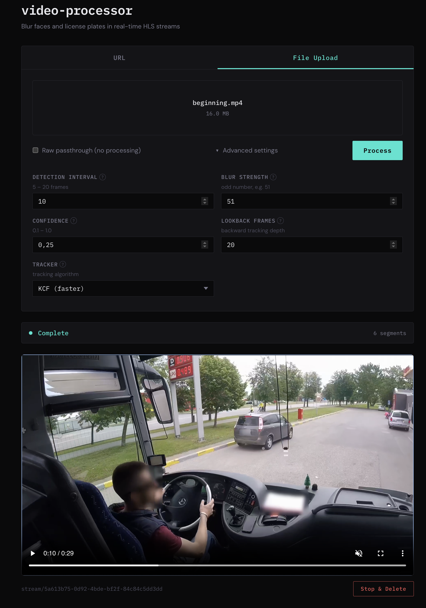

# Video Processor

Blur faces and license plates in video files using YOLO detection and OpenCV tracking. Supports both a standalone CLI tool for file processing and a fullstack web application for real-time HLS streaming.

## Contents

- [CLI Tool](#cli-tool)
- [Fullstack Streaming Application](#fullstack-streaming-application)

---

## CLI Tool

A Python command-line tool for processing local video files. Detects and blurs faces and license plates in an MP4 file, optionally generating a per-frame detection report. No GPU or server infrastructure required.

### Prerequisites

- **Python 3.10+**
- **Git** (to clone the repository)

### Setup

```bash
# Mac / Linux
cd processor
bash install.sh

# Windows
cd processor
install.bat
```

Detection models and FFmpeg are downloaded automatically on first run and cached in `~/.cache/video_processor/` (macOS/Linux) or `%LOCALAPPDATA%\video_processor\` (Windows).

> The install script fixes an OpenCV conflict: `ultralytics` pulls in `opencv-python`, but the CSRT/KCF trackers require `opencv-contrib-python`. The script installs everything then swaps the OpenCV package.

For full setup details and server extras see [processor/README.md → Setup](processor/README.md#setup).

### Usage

```bash
video-processor <input.mp4> [options]
```

```bash
# Blur faces and plates — output saved as blurred_my_video.mp4 next to the input
video-processor my_video.mp4

# Write output to a specific directory or file
video-processor my_video.mp4 --output /tmp/
video-processor my_video.mp4 --output /tmp/result.mp4

# Generate the detection report only, without writing a blurred video
video-processor my_video.mp4 --no-video-output

# Enable debug output
video-processor my_video.mp4 --debug
```

Full CLI reference: [all options](processor/README.md#cli-usage) · [debug mode](processor/README.md#debug-mode) · [pipeline details](processor/README.md#how-blurring-works)

---

## Fullstack Streaming Application

A three-tier web application for real-time video anonymization over HLS. A React UI lets users paste an HLS stream URL or upload a video file; NestJS orchestrates segmentation and status polling; Python performs frame-level YOLO detection and blurring on each segment. Processed segments are served back as a playable HLS stream in the browser.



### Prerequisites

**Docker (recommended):** [Docker Desktop](https://www.docker.com/products/docker-desktop/) (Mac/Windows) or Docker Engine + Compose v2 (Linux).

**Local (manual):** Python 3.10+, Node.js ≥ 24, pnpm ≥ 10.

### Quickstart — Docker

```bash
# Mac / Linux
bash run.sh

# Windows
run.bat
```

On first run the processor downloads the YOLO models (~30 MB) into a named Docker volume. Subsequent starts are instant. Open **http://localhost:3000** once the script reports "Ready!".

| Service | Host port |
|---------|-----------|
| NestJS server + React UI | **3000** |
| Python processor (FastAPI) | not exposed |

### Running locally (manual)

```bash
# Terminal 1 — Python anonymization service
cd processor
bash install.sh                                  # first time only
.venv/bin/pip install -e ".[server]"             # first time only
.venv/bin/uvicorn video_processor.server:app --reload --port 8000

# Terminal 2 — NestJS orchestration server
cd server && npm run start:dev

# Terminal 3 — React dev server
cd client && npm run dev   # → http://localhost:5173
```

Full setup details: [Python streaming service](processor/README.md#streaming-api) · [NestJS server](server/README.md#setup) · [React client](client/README.md#setup)

### Further reading

| Topic | Reference |
|-------|-----------|
| Python processor — CLI, pipeline, streaming API | [processor/README.md](processor/README.md) |
| NestJS server — API reference, environment variables, architecture | [server/README.md](server/README.md) |
| React client — components, hooks, HLS playback | [client/README.md](client/README.md) |
