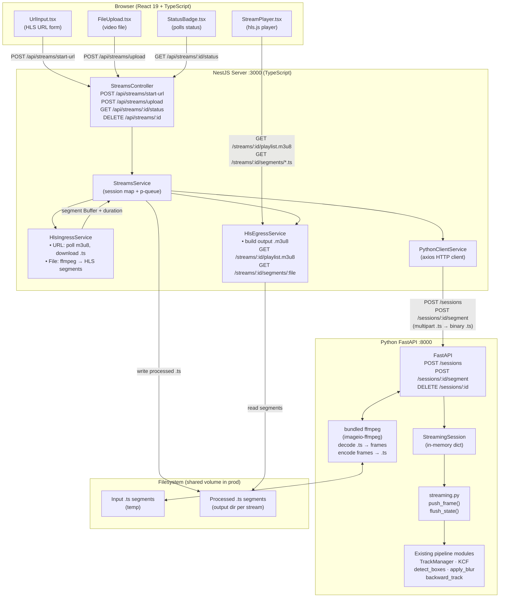

# HLS Streaming Architecture — Specification & Implementation Plan

## 1. Concept & Design Philosophy

### Problem Statement
The existing `video-processor` is a batch tool: it reads an entire MP4, blurs faces and plates, re-muxes audio, and writes a new file. Adding live HLS streaming requires a fundamentally different execution model — one that processes bounded chunks of video (_segments_) in sequence while maintaining detection/tracking continuity across those boundaries.

### Why Segment-Based Processing?
HLS is inherently segment-based. Each `.ts` file is a self-contained, independently decodable unit of video (typically 2–6 s). Reusing this natural chunking means:
- The Python service can operate on whole, decodable units rather than raw frames over a socket, which is fragile and harder to recover from errors.
- Audio is carried inside each `.ts` segment, so audio/video sync is naturally preserved without the post-hoc FFmpeg mux needed in the batch pipeline.
- The Node.js layer only needs to act as an HLS proxy + orchestrator — no deep media knowledge required.
- Retry semantics are segment-granular: a failed segment can be re-submitted without rewinding the entire stream.

### Why Stateful Sessions in Python?
KCF tracker state cannot be transferred between segments without maintaining the tracker object in memory. If each segment were processed independently, every segment boundary would cause all track IDs to reset, producing flickering blur regions at the seam. Stateful sessions solve this:
- `TrackManager` and all KCF tracker instances live in a Python `StreamingSession` object.
- The session persists across sequential segment calls for the lifetime of the stream.
- The frame lookback buffer also persists, so backward-tracking can partially reach into the previous segment.

### Latency Budget
```
HLS segment duration:     2 s
Python lookback buffer:   30 frames @ 30 fps = 1 s of additional lag
HLS player buffer:        ~2 segments = 4 s (hls.js default)
Network round-trip:       ~0.1–0.3 s
─────────────────────────────────────────────
Total end-to-end latency: ~7–8 s (acceptable for face/plate blurring use case)
```

### Chosen Stack
| Layer | Technology | Rationale |
|---|---|---|
| ML inference | Python 3.11, FastAPI, uvicorn | Models are Python-native; FastAPI gives async endpoints with minimal overhead |
| Orchestration | NestJS (TypeScript) | Strong DI, module system, well-suited to managing multiple async I/O concerns |
| Frontend | React 19 + Vite + hls.js (TypeScript) | React 19 compiler, concurrent features, component model for multi-mode input UI; hls.js for in-browser HLS playback |
| Containerisation | Docker Compose | Dev: native processes. Prod: compose ties all services together |

---

## 1.5 System Architecture Diagram



---

## 2. Repository Layout

```
processor/                    ← Python FastAPI service
│  video_processor/           ← existing Python package (modified)
│  │  cli.py                  (unchanged)
│  │  pipeline.py             (unchanged — batch processing preserved)
│  │  detection.py            (unchanged)
│  │  track_manager.py        (unchanged)
│  │  track.py                (unchanged)
│  │  frame_ops.py            (unchanged)
│  │  audio.py                (unchanged)
│  │  models.py               (unchanged)
│  │  streaming.py            ← NEW: frame-level streaming state machine
│  │  server.py               ← NEW: FastAPI service
│  pyproject.toml             (modified: add fastapi, uvicorn, python-multipart)
│  install.sh / install.bat

server/                       ← NEW: NestJS orchestration server
│  src/
│  │  app.module.ts
│  │  main.ts
│  │  streams/
│  │  │  streams.module.ts
│  │  │  streams.controller.ts
│  │  │  streams.service.ts
│  │  │  dto/
│  │  │  │  start-url.dto.ts
│  │  │  │  stream-status.dto.ts
│  │  hls/
│  │  │  hls.module.ts
│  │  │  hls-ingress.service.ts
│  │  │  hls-egress.service.ts
│  │  python-client/
│  │     python-client.module.ts
│  │     python-client.service.ts
│  package.json
│  tsconfig.json

client/                       ← NEW: React 19 + Vite + TypeScript frontend
│  src/
│  │  App.tsx
│  │  components/
│  │  │  StreamPlayer.tsx
│  │  │  UrlInput.tsx
│  │  │  FileUpload.tsx
│  │  │  StatusBadge.tsx
│  │  hooks/
│  │  │  useStream.ts
│  │  api/
│  │     streamsApi.ts
│  index.html
│  vite.config.ts
│  package.json

docs/
│  StreamingPlan.md           ← this document
│  blur_box_scenarios.md      (existing)

Dockerfile.processor          ← NEW
Dockerfile.server             ← NEW (builds client, serves via NestJS)
docker-compose.yml            ← NEW
```

---

## 3. Python Service Design

### 3.1 `video_processor/streaming.py`

**Purpose:** Decouple the frame-processing logic from file I/O so that the same detection/tracking machinery can be driven one frame at a time from any source.

**Core abstraction — `StreamingState`:**
```python
@dataclass
class StreamingState:
    face_model: YOLO
    plate_model: LicensePlateDetector
    detection_interval: int
    blur_strength: int
    conf: float
    lookback_frames: int
    width: int
    height: int
    fps: float
    track_mgr: TrackManager
    frame_buffer:       deque[np.ndarray]
    boxes_buffer:       deque[list[Box]]
    index_buffer:       deque[int]
    detect_flag_buffer: deque[bool]
    debug_buffer:       deque[list[tuple]]
    frame_idx: int = 0
```

**Public API:**
```python
def create_session_state(face_model, plate_model, *, detection_interval, blur_strength,
                          conf, lookback_frames, width, height, fps) -> StreamingState:
    """Construct a fresh streaming state. Called once per stream session."""

def push_frame(state: StreamingState, frame: np.ndarray) -> np.ndarray | None:
    """
    Accept one BGR frame, run detect-or-track, buffer it.
    Returns the oldest blurred frame once the buffer is full (lookback_frames reached),
    otherwise returns None.
    Mirrors pipeline.py's main loop body exactly.
    """

def flush_state(state: StreamingState) -> list[np.ndarray]:
    """
    Drain all remaining buffered frames (apply blur to each).
    Called at end-of-segment and on session cleanup.
    """
```

**Implementation notes:**
- `push_frame` is a direct extraction of the `while True` loop body from `pipeline.py`, minus file I/O.
- Backward tracking works identically — `track_mgr.pop_new_tracks()` → `backward_track()` → retroactively update `boxes_buffer`.
- Frame index is **global across the session**, not per-segment. This preserves `detection_interval` cadence across segment boundaries.

### 3.2 `video_processor/server.py`

**Startup:** Load models once with existing `load_models()` from `models.py`. Models are shared across all sessions (read-only after loading).

**Session store:**
```python
sessions: dict[str, StreamingSession] = {}

@dataclass
class StreamingSession:
    state: StreamingState
    created_at: float
    last_used_at: float
```

A background task (`asyncio` periodic coroutine) cleans up sessions idle for >10 minutes — prevents memory leak when clients disconnect without calling DELETE.

**Endpoints:**

```
POST /sessions
Body JSON: {
  "detection_interval": int,   # default 5
  "blur_strength":      int,   # default 51, must be odd
  "conf":               float, # default 0.25
  "lookback_frames":    int,   # default 30
  "width":              int,   # required
  "height":             int,   # required
  "fps":                float  # required
}
Response: { "session_id": "<uuid4>" }

POST /sessions/{session_id}/segment
Content-Type: multipart/form-data  (field name: "segment")
Body: raw .ts bytes
Response 200: binary .ts bytes (processed)
Response 404: session not found
Response 422: decode/probe failure

DELETE /sessions/{session_id}
Response: 204 No Content
```

**Segment processing pipeline (inside the POST handler):**

```
1. Write incoming bytes → tmp_in.ts  (tempfile.NamedTemporaryFile)
2. PROBE with ffprobe -v quiet -of json -show_streams tmp_in.ts
   → extract width, height, fps, has_audio
3. DECODE VIDEO frames:
   ffmpeg -i tmp_in.ts -f rawvideo -pix_fmt bgr24 pipe:1
   → read in chunks of (width × height × 3) bytes → list[np.ndarray]
4. EXTRACT AUDIO (if present):
   ffmpeg -i tmp_in.ts -vn -acodec copy tmp_audio.aac
5. PROCESS frames:
   output_frames = []
   for frame in decoded_frames:
       result = push_frame(state, frame)
       if result is not None:
           output_frames.append(result)
6. FLUSH + RE-PRIME buffer:
   output_frames.extend(flush_state(state))
   # Seed next segment's lookback buffer with the last N frames of this segment
   # so backward-tracking can reach across the segment boundary:
   for frame in decoded_frames[-state.lookback_frames:]:
       state.frame_buffer.append(frame.copy())
       state.boxes_buffer.append([])
       state.index_buffer.append(...)
       state.detect_flag_buffer.append(False)
       state.debug_buffer.append([])
7. RE-ENCODE:
   ffmpeg -f rawvideo -s {W}x{H} -r {fps} -pix_fmt bgr24 -i pipe:0
          [-i tmp_audio.aac -c:a copy]
          -c:v libx264 -preset veryfast -crf 23 -f mpegts pipe:1
   → pipe output_frames in, collect stdout bytes
8. Return Response(content=bytes, media_type="video/mp2t")
9. Cleanup temp files
```

**Key insight — buffer re-priming (Step 6):** After flushing, the final frames of the current segment are re-inserted into the lookback buffer. This allows the very first detection in segment N+1 to trigger backward-tracking that reaches back into segment N, preserving smooth blur continuity at boundaries.

**FFmpeg binary:** `imageio_ffmpeg.get_ffmpeg_exe()` — bundled, no system ffmpeg required.

### 3.3 `pyproject.toml` additions
```toml
"fastapi>=0.111",
"uvicorn[standard]>=0.29",
"python-multipart>=0.0.9",
```

---

## 4. NestJS Server Design

### 4.1 Module Structure

```
AppModule
 ├── StreamsModule        (controller + service, manages stream lifecycle)
 ├── HlsModule            (ingress + egress services)
 └── PythonClientModule   (HTTP client, injected into StreamsModule)
 └── ServeStaticModule    (serves React build from client/dist at /)
```

### 4.2 `PythonClientModule`

`python-client.service.ts` — wraps all Python API calls via `axios`:

```typescript
interface SessionParams {
  detectionInterval: number;
  blurStrength: number;
  conf: number;
  lookbackFrames: number;
  width: number;
  height: number;
  fps: number;
}

class PythonClientService {
  async createSession(params: SessionParams): Promise<string>   // → session_id
  async processSegment(sessionId: string, tsBuffer: Buffer): Promise<Buffer>
  async deleteSession(sessionId: string): Promise<void>
}
```

- Base URL from env `PYTHON_SERVICE_URL` (default `http://localhost:8000`).
- On HTTP 5xx: throw `InternalServerErrorException`; caller marks stream as `error`.

### 4.3 `HlsIngressService`

**URL mode** — live HLS or VOD m3u8:
1. Fetch m3u8, parse with `hls-parser`.
2. Detect MASTER vs MEDIA playlist; for MASTER, select highest-bandwidth variant.
3. Track processed segment URIs in `Set<string>` to avoid reprocessing.
4. Download each new `.ts` as `Buffer` via axios (`arraybuffer` response type).
5. **Live:** poll every `targetDuration` seconds; terminate when `#EXT-X-ENDLIST` seen.
6. **VOD:** walk all segments once, then stop.

**File upload mode:**
1. Receive file via `multer`, save to temp path.
2. Run ffmpeg to segment into HLS:
   ```
   ffmpeg -i input.mp4 -c:v libx264 -preset veryfast
          -hls_time 2 -hls_list_size 0
          -hls_segment_filename seg_%04d.ts output.m3u8
   ```
3. Parse resulting m3u8, read `.ts` files as `Buffer` in sequence.

**`SegmentCallback` type:**
```typescript
type SegmentCallback = (segment: {
  buffer:   Buffer;
  duration: number;   // seconds from #EXTINF
  sequence: number;   // 0-based index
}) => void;
```

### 4.4 `StreamsService`

Stream session state:
```typescript
interface StreamSession {
  streamId:        string;
  pythonSessionId: string;
  status:          'starting' | 'processing' | 'done' | 'error';
  inputType:       'url' | 'file';
  outputDir:       string;
  outputSegments:  OutputSegment[];
  segmentQueue:    PQueue;    // p-queue, concurrency = 1
  error?:          string;
}
```

On each segment received from `HlsIngressService`:
1. Enqueue to `segmentQueue` (concurrency = 1 guarantees ordering).
2. Job: `pythonClient.processSegment(pythonSessionId, buffer)` → `processedBuffer`.
3. Write `processedBuffer` → `outputDir/seg_NNNN.ts`.
4. Push `{ filename, duration, sequence }` → `outputSegments`.
5. Call `hlsEgress.invalidate(streamId)` to trigger playlist rebuild.

On error: set `status = 'error'`, stop ingress polling, call `pythonClient.deleteSession`.

**REST Controller routes:**
```
POST   /api/streams/start-url   { url: string }         → { streamId }
POST   /api/streams/upload      multipart video file     → { streamId }
GET    /api/streams/:id/status                           → { status, segmentCount, error? }
DELETE /api/streams/:id
```

### 4.5 `HlsEgressService`

Builds the output m3u8 dynamically from `outputSegments[]`:

```
#EXTM3U
#EXT-X-VERSION:3
#EXT-X-TARGETDURATION:3
#EXT-X-MEDIA-SEQUENCE:{firstSequence}
#EXTINF:{duration},
/streams/{streamId}/segments/seg_NNNN.ts
…
[#EXT-X-ENDLIST]   ← appended only when status = 'done'
```

- **Live streams:** sliding window of last 5 segments (stable playlist size for players).
- **VOD (file upload):** full segment list + `#EXT-X-ENDLIST` when processing is complete.

Controller routes:
```
GET /streams/:id/playlist.m3u8        → Content-Type: application/vnd.apple.mpegurl
GET /streams/:id/segments/:filename   → send file from outputDir
```

### 4.6 NestJS Dependencies
```json
{
  "dependencies": {
    "@nestjs/common": "^10",
    "@nestjs/core": "^10",
    "@nestjs/platform-express": "^10",
    "@nestjs/serve-static": "^4",
    "axios": "^1",
    "multer": "^1",
    "uuid": "^9",
    "hls-parser": "^0.12",
    "fluent-ffmpeg": "^2",
    "p-queue": "^7"
  },
  "devDependencies": {
    "@types/multer": "^1",
    "@types/uuid": "^9",
    "@types/fluent-ffmpeg": "^2",
    "@nestjs/cli": "^10",
    "typescript": "^5"
  }
}
```

---

## 5. React Frontend Design

### 5.0 Scaffold & Tooling

```bash
npm create vite@latest client -- --template react-ts
cd client
npm install react@^19 react-dom@^19
npm install -D @types/react@^19 @types/react-dom@^19
npm install axios hls.js
```

`tsconfig.json`: `"target": "ES2022"`, `"strict": true`, `"jsx": "react-jsx"`.

### 5.1 Component Tree
```
App
 ├── InputPanel
 │    ├── UrlInput          → POST /api/streams/start-url
 │    └── FileUpload        → POST /api/streams/upload (multipart)
 ├── StatusBadge            → polls GET /api/streams/:id/status every 2 s
 └── StreamPlayer           → hls.js, src = /streams/:id/playlist.m3u8
```

### 5.2 `useStream` hook
```typescript
function useStream() {
  const [streamId, setStreamId] = useState<string | null>(null);
  const [status, setStatus] = useState<StreamStatus | null>(null);

  async function startUrl(url: string): Promise<void>
  async function uploadFile(file: File): Promise<void>
  async function stop(): Promise<void>

  // Effect: poll status every 2 s while streamId != null
  // Effect: stop polling when status === 'done' | 'error'

  return { streamId, status, startUrl, uploadFile, stop };
}
```

### 5.3 `StreamPlayer.tsx`
```typescript
// Attaches hls.js to a <video> ref when playlistUrl changes.
// Calls hls.loadSource(url) + hls.attachMedia(videoEl).
// On HLS_ERROR: show error UI state.
// Cleanup: hls.destroy() on unmount or URL change.
```

### 5.4 `vite.config.ts`
```typescript
// Dev proxy: forwards /api and /streams to NestJS on :3000
// eliminates CORS issues during local development
server: {
  proxy: {
    '/api':     'http://localhost:3000',
    '/streams': 'http://localhost:3000',
  }
}
```

---

## 6. Docker / Production

### `Dockerfile.processor`
```dockerfile
FROM python:3.11-slim
WORKDIR /app
COPY processor/pyproject.toml processor/install.sh ./
COPY processor/video_processor/ ./video_processor/
RUN bash install.sh
CMD ["uvicorn", "video_processor.server:app", "--host", "0.0.0.0", "--port", "8000"]
```

### `Dockerfile.server` (multi-stage)
```dockerfile
FROM node:22-alpine AS build-client
WORKDIR /client
COPY client/package*.json ./
RUN npm ci
COPY client/ ./
RUN npm run build   # → dist/

FROM node:22-alpine AS build-server
WORKDIR /server
COPY server/package*.json ./
RUN npm ci
COPY server/ ./
RUN npm run build

FROM node:22-alpine
WORKDIR /app
COPY --from=build-server /server/dist ./dist
COPY --from=build-server /server/node_modules ./node_modules
COPY --from=build-client /client/dist ./client/dist
CMD ["node", "dist/main.js"]
```

### `docker-compose.yml`
```yaml
version: "3.9"
services:
  python:
    build:
      context: .
      dockerfile: Dockerfile.processor
    ports: ["8000:8000"]
    volumes:
      - model_cache:/root/.cache/video_processor

  server:
    build:
      context: .
      dockerfile: Dockerfile.server
    ports: ["3000:3000"]
    environment:
      PYTHON_SERVICE_URL: http://python:8000
      OUTPUT_DIR: /tmp/streams
    volumes:
      - stream_segments:/tmp/streams
    depends_on: [python]

volumes:
  model_cache:
  stream_segments:
```

---

## 7. Step-by-Step Implementation Order

Each step is independently verifiable before proceeding.

| # | Step | Files | Verification |
|---|------|-------|--------------|
| 1 | Write this spec | `docs/StreamingPlan.md` | File exists and is readable |
| 2 | Add FastAPI deps | `processor/pyproject.toml` | `pip install -e .` succeeds |
| 3 | Implement `streaming.py` | `processor/video_processor/streaming.py` | Push 90 frames with lookback=60: expect 30 frames returned during push, 60 on flush |
| 4 | Implement `server.py` | `processor/video_processor/server.py` | `curl POST /sessions` → session_id; `curl POST /sessions/:id/segment` with real `.ts` → binary response |
| 5 | Scaffold NestJS | `server/` | `npm run start:dev` starts without errors |
| 6 | `PythonClientModule` | `server/src/python-client/` | Integration: createSession → processSegment → deleteSession against live Python service |
| 7 | `HlsIngressService` | `server/src/hls/hls-ingress.service.ts` | Mock axios; confirm segment callback fires for each segment in a fixture m3u8 |
| 8 | `StreamsModule` + routes | `server/src/streams/` | POST `/api/streams/start-url` with public HLS URL; GET status returns `segmentCount > 0` |
| 9 | `HlsEgressService` | `server/src/hls/hls-egress.service.ts` | GET playlist.m3u8 returns valid m3u8; segment `.ts` is downloadable |
| 10 | Scaffold React 19 + Vite | `client/` | `npm run dev` starts; `tsc --noEmit` passes |
| 11 | `StreamPlayer` component | `client/src/components/StreamPlayer.tsx` | Point at a static public HLS URL; hls.js plays without console errors |
| 12 | `UrlInput` + `useStream` | `client/src/components/UrlInput.tsx`, `client/src/hooks/useStream.ts` | Enter URL → streamId logged → player loads processed stream |
| 13 | `FileUpload` component | `client/src/components/FileUpload.tsx` | Upload local MP4 → player plays processed stream |
| 14 | `StatusBadge` | `client/src/components/StatusBadge.tsx` | Segment count increments live as stream processes |
| 15 | NestJS serves React build | `server/src/app.module.ts` (ServeStaticModule) | `npm run build` in client; `npm run start` in server; `localhost:3000` serves React app |
| 16 | `Dockerfile.python` | `Dockerfile.python` | `docker build -f Dockerfile.python .` succeeds |
| 17 | `Dockerfile.server` | `Dockerfile.server` | `docker build -f Dockerfile.server .` succeeds |
| 18 | `docker-compose.yml` | `docker-compose.yml` | `docker-compose up` → full end-to-end test at `localhost:3000` |

---

## 8. Error Handling & Edge Cases

| Scenario | Handling |
|----------|---------|
| Python service unreachable | NestJS marks stream `error`; frontend shows error via status poll |
| Corrupt `.ts` segment (decode fails) | Python returns 422; NestJS logs warning, skips segment, continues |
| Session idle > 10 min | Python background task deletes session and frees KCF tracker memory |
| Client disconnects without DELETE | Same idle cleanup covers this |
| ffmpeg not found in Python env | `imageio_ffmpeg.get_ffmpeg_exe()` raises at startup — fail fast with clear message |
| HLS input stream ends (`#EXT-X-ENDLIST`) | NestJS detects, drains processing queue, appends ENDLIST to output playlist |
| Segments processed out of submission order | `p-queue` concurrency=1 guarantees write order matches submission order |
| `blur_strength` is even | FastAPI model validator rejects with 422 (Gaussian kernel must be odd) |

---

## 9. Local Development Workflow

```bash
# Terminal 1 — Python service (hot reload)
cd processor
source .venv/bin/activate
uvicorn video_processor.server:app --reload --port 8000

# Terminal 2 — NestJS server (hot reload)
cd server && npm run start:dev

# Terminal 3 — React dev server
cd client && npm run dev
# → http://localhost:5173
# /api and /streams proxied to localhost:3000 via vite.config.ts
```
